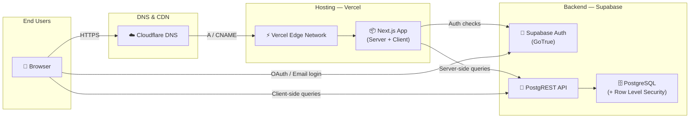
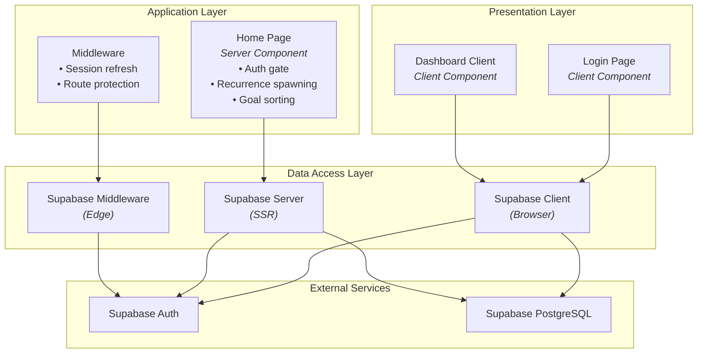
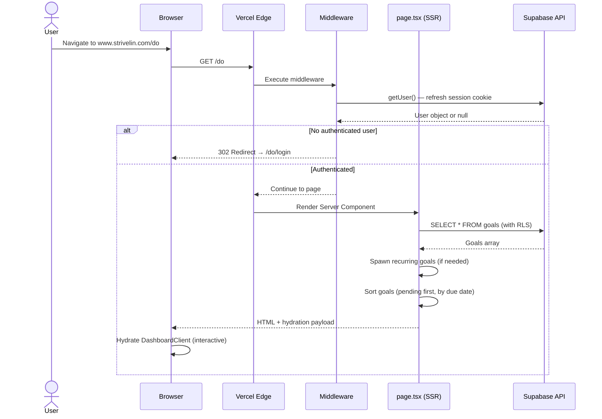
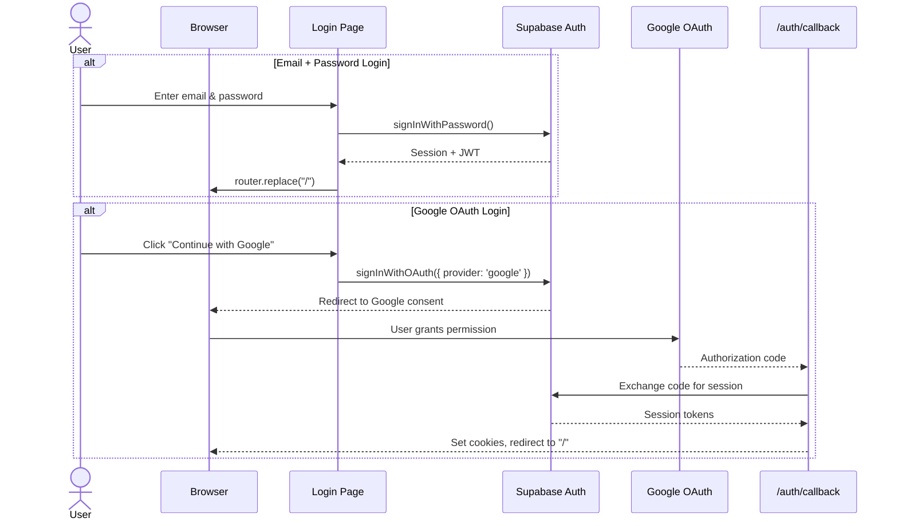
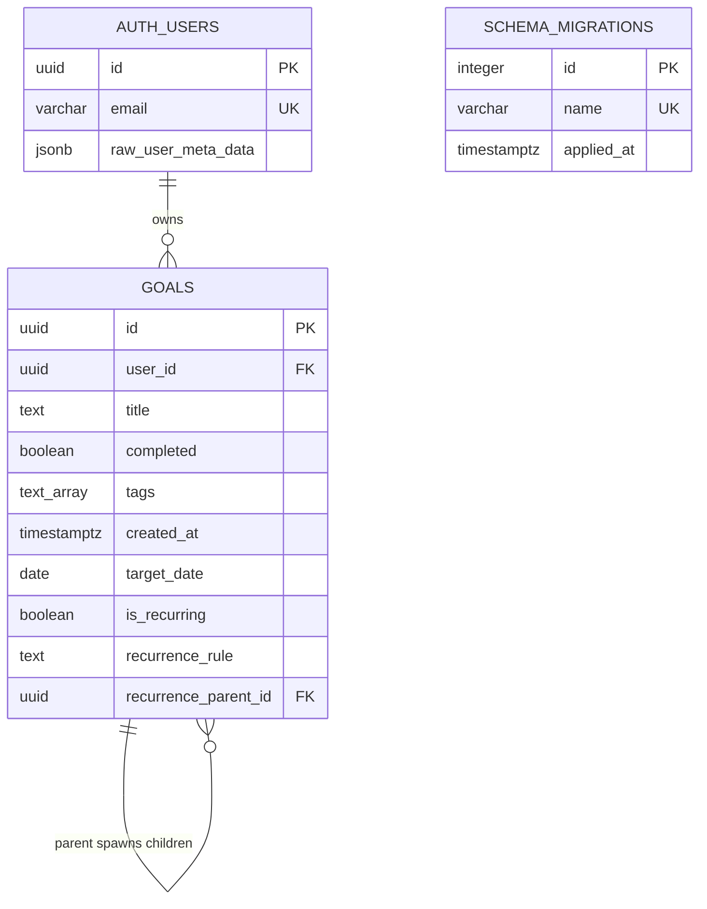
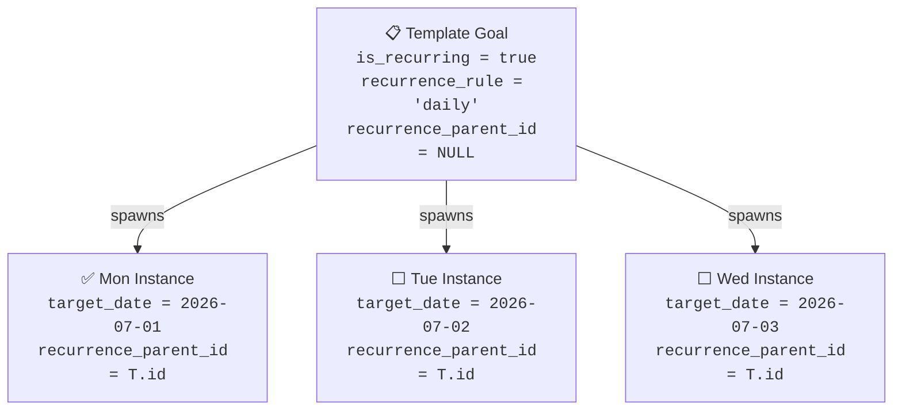
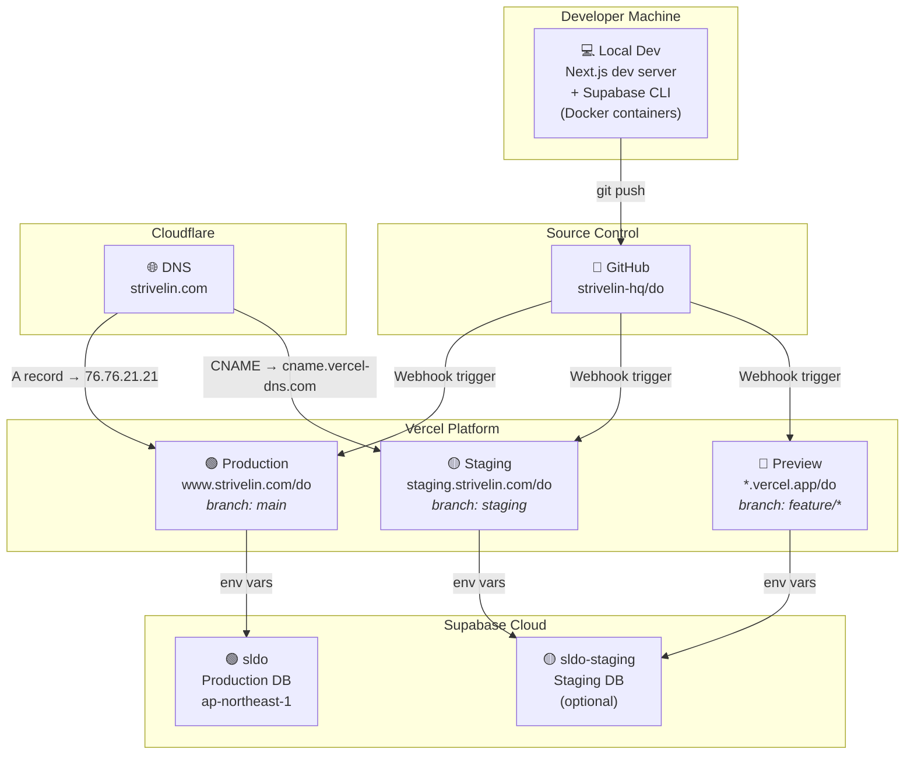
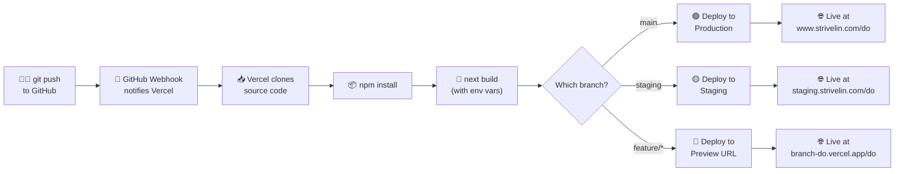
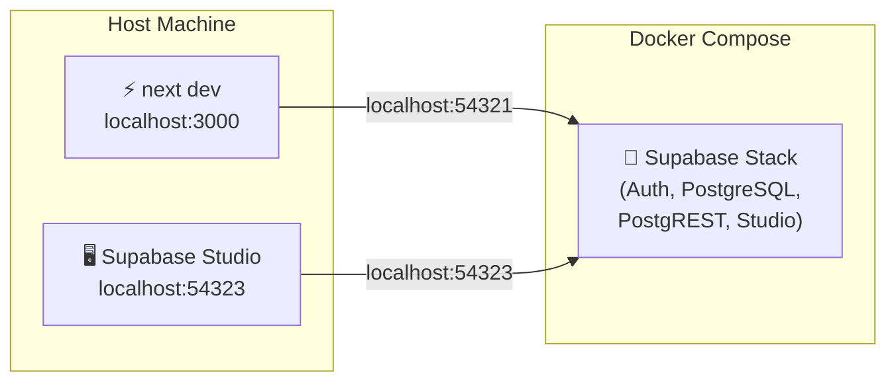
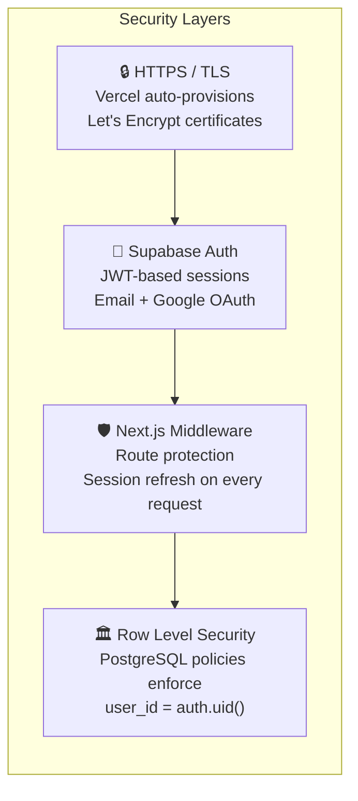

# Strivelin Do — Design & Architecture Document

> **Version**: 1.0  
> **Last Updated**: 2026-07-04  
> **Project**: `strivelin-do` — Zero-friction multi-user targets tracker  
> **Repository**: [strivelin-hq/do](https://github.com/strivelin-hq/do)

---

## 1. System Overview

Strivelin Do is a full-stack goal-tracking SaaS application. Users sign up, create goals with optional tags and due dates, set up recurring rules (daily, weekdays, weekly, monthly), and track completion. The system automatically spawns recurring goal instances on the server side each day.



### Key Design Decisions

| Decision | Rationale |
|:---|:---|
| **Next.js App Router** (v16) | Server Components for SSR data fetching; Client Components for interactivity. Single codebase for frontend + API. |
| **Supabase (hosted PostgreSQL)** | Managed auth, realtime, and PostgREST API — eliminates the need for a custom backend. |
| **Row Level Security (RLS)** | Data isolation enforced at the database layer; even a compromised API key cannot access other users' data. |
| **Dynamic `basePath`** | Allows the app to run at `/do` in production and `/` locally, controlled by a single environment variable. |
| **Cloudflare DNS (free)** | At-cost domain registration, free DNS, optional DDoS protection. |

---

## 2. Application Architecture

### 2.1 High-Level Layers



### 2.2 Project File Structure

```
strivelin-do/
├── src/
│   ├── app/
│   │   ├── layout.tsx              # Root layout (HTML shell, fonts, metadata)
│   │   ├── page.tsx                # Home / Dashboard (Server Component)
│   │   ├── page.module.css         # Dashboard-specific styles
│   │   ├── globals.css             # Global design system (29 KB)
│   │   ├── login/
│   │   │   └── page.tsx            # Login / Sign-up form (Client Component)
│   │   └── auth/
│   │       └── callback/
│   │           └── route.ts        # OAuth callback handler
│   ├── components/
│   │   └── DashboardClient.tsx     # Interactive goal CRUD UI (Client Component, 35 KB)
│   ├── middleware.ts               # Edge middleware entry point
│   └── utils/
│       └── supabase/
│           ├── client.ts           # Browser Supabase client factory
│           ├── server.ts           # SSR Supabase client factory
│           └── middleware.ts       # Session refresh + route protection logic
├── migrations/
│   ├── 0001_create_goals_table.sql # Base schema: goals table, RLS policies
│   └── 0002_add_target_date_recurrence.sql  # Recurring goals columns + indexes
├── scripts/
│   ├── migrate.js                  # Database migration runner (Node.js + pg)
│   ├── compare-schemas.js          # Schema comparison utility
│   ├── compare.sh                  # Full schema drift detection
│   ├── run.sh / stop.sh / build.sh # Docker lifecycle scripts
│   └── stage.sh                    # Staging environment launcher
├── supabase/                       # Local Supabase CLI config & migrations
├── docs/
│   ├── architecture.md             # This document
│   └── deployment_guide.md         # Step-by-step deployment instructions
├── next.config.ts                  # Dynamic basePath, standalone output
├── Dockerfile                      # Multi-stage Docker build (for self-hosted)
├── docker-compose.yml              # Local dev with Supabase containers
└── package.json                    # Dependencies & scripts
```

### 2.3 Request Flow — Page Load



### 2.4 Authentication Flow



---

## 3. Database Schema

### 3.1 Entity Relationship Diagram



### 3.2 Row Level Security Policies

All data access is governed by PostgreSQL RLS. Even if the `anon` key is exposed (it is public by design), users can only interact with their own rows:

| Policy | Operation | Rule |
|:---|:---|:---|
| Users can read their own goals | `SELECT` | `auth.uid() = user_id` |
| Users can insert their own goals | `INSERT` | `auth.uid() = user_id` |
| Users can update their own goals | `UPDATE` | `auth.uid() = user_id` |
| Users can delete their own goals | `DELETE` | `auth.uid() = user_id` |

### 3.3 Indexes

| Index | Columns | Purpose |
|:---|:---|:---|
| `idx_goals_recurrence_parent` | `recurrence_parent_id` (partial: WHERE NOT NULL) | Fast lookup of child instances for a recurring template |
| `idx_goals_target_date` | `(user_id, completed, target_date)` | Efficient sorting of a user's pending goals by due date |

### 3.4 Recurrence Model



Recurring goals use a **template-instance pattern**:
- A **template** (`is_recurring = true`, `recurrence_parent_id = NULL`) defines the rule (daily, weekdays, weekly, monthly).
- Each day, the server-side `page.tsx` checks templates and **spawns child instances** with `target_date = today` and `recurrence_parent_id = template.id`.
- Children are regular one-off goals that can be independently completed or deleted.

---

## 4. Git Branching Strategy

```mermaid
gitgraph
    commit id: "Initial commit"
    commit id: "Feature A"
    branch staging
    checkout staging
    commit id: "Feature B (testing)"
    commit id: "Bug fix"
    checkout main
    merge staging id: "Release v0.2"
    checkout staging
    commit id: "Feature C (testing)"
    checkout main
    commit id: "Hotfix"
```

### Branch Roles

| Branch | Purpose | Deploys To | Domain |
|:---|:---|:---|:---|
| **`main`** | Production-ready code | Vercel **Production** | `www.strivelin.com/do` |
| **`staging`** | Pre-release testing & QA | Vercel **Preview** | `staging.strivelin.com/do` |
| **`feature/*`** | Individual feature work | Vercel **Preview** (auto) | `<branch>-do.vercel.app/do` |

### Workflow

1. **Develop** on a `feature/*` branch. Push to GitHub → Vercel auto-deploys a temporary preview URL.
2. **Merge** the feature branch into `staging` via Pull Request. Vercel deploys to `staging.strivelin.com/do`.
3. **Test and QA** on the staging subdomain with a separate staging database.
4. **Merge** `staging` into `main` via Pull Request. Vercel deploys to production `www.strivelin.com/do`.
5. **Hotfixes** go directly to `main` and are cherry-picked back to `staging`.

---

## 5. Deployment Architecture

### 5.1 Infrastructure Topology



### 5.2 Deployment Pipeline (CI/CD)



### 5.3 Environment Variables

| Variable | Production | Staging / Preview | Description |
|:---|:---|:---|:---|
| `NEXT_PUBLIC_BASE_PATH` | `/do` | `/do` | Subpath under which the app is served |
| `NEXT_PUBLIC_SUPABASE_URL` | `https://fqlwvjjsjuwbbempjvyi.supabase.co` | *(staging project URL)* | Supabase API endpoint |
| `NEXT_PUBLIC_SUPABASE_ANON_KEY` | *(production anon key)* | *(staging anon key)* | Public API key (safe to expose) |
| `SUPABASE_URL` | *(same as above)* | *(staging project URL)* | Server-side Supabase URL |
| `DATABASE_URL` | `postgres://...pooler...6543/postgres` | *(staging DB URI)* | Direct DB connection for migrations |

### 5.4 Local Development Setup



Local development uses:
- **Supabase CLI** (`supabase start`) to run a full local Supabase stack in Docker containers.
- **`next dev`** connects to the local Supabase instance via `localhost:54321`.
- **No cloud dependency** — everything runs offline.

---

## 6. Security Architecture



| Layer | Protection |
|:---|:---|
| **Transport** | All traffic is HTTPS. Vercel auto-provisions TLS certificates via Let's Encrypt. |
| **Authentication** | Supabase GoTrue issues JWTs. Supports email/password and Google OAuth. |
| **Authorization (App)** | Next.js middleware intercepts every request. Unauthenticated users are redirected to `/login`. |
| **Authorization (DB)** | PostgreSQL RLS policies ensure users can only SELECT, INSERT, UPDATE, DELETE their own goals. Even a leaked `anon` key cannot access other users' data. |

---

## 7. Technology Stack Summary

| Layer | Technology | Version |
|:---|:---|:---|
| **Framework** | Next.js (App Router) | 16.2.9 |
| **Runtime** | React | 19.2.4 |
| **Language** | TypeScript | 5.x |
| **Styling** | Vanilla CSS (globals.css) | — |
| **Icons** | Lucide React | 1.21.0 |
| **Auth & Database** | Supabase (Auth + PostgreSQL + PostgREST) | 2.108.2 |
| **SSR Integration** | @supabase/ssr | 0.12.0 |
| **Hosting** | Vercel (Hobby plan) | — |
| **DNS** | Cloudflare (Free plan) | — |
| **Container** | Docker (multi-stage, Node 20 Alpine) | — |
| **Source Control** | Git + GitHub | — |
